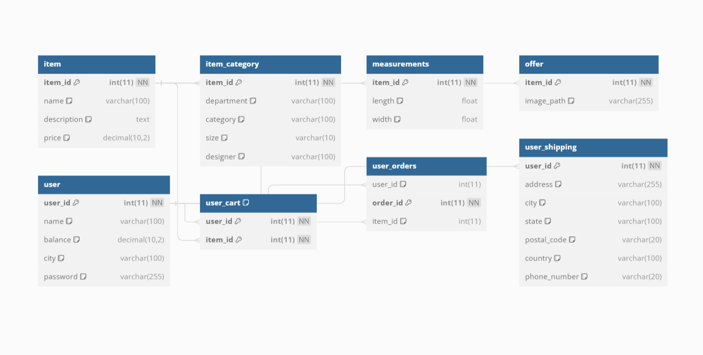

# Wprowadzenie

Grailz to innowacyjna aplikacja mobilna i internetowa przeznaczona do sprzedaży odzieży. Projekt łączy w sobie elementy tradycyjnej marki odzieżowej z nowoczesnymi rozwiązaniami e-commerce, umożliwiając użytkownikom przeglądanie, kupowanie i sprzedaż ubrań w prosty i intuicyjny sposób.

# Cel i Zakres Projektu

**Cel:**

- Stworzenie platformy, która umożliwia użytkownikom sprzedaż i zakup odzieży.
- Zbudowanie rozpoznawalnej marki odzieżowej, która przyciąga klientów dzięki unikalnym projektom i wysokiej jakości produktom.

**Zakres:**

- Projektowanie i rozwój strony internetowej.
- Integracja z systemami płatności i zarządzania zamówieniami.
- Implementacja funkcji społecznościowych, takich jak recenzje użytkowników i profile sprzedawców.

# Funkcjonalności

- **Rejestracja i logowanie:** Użytkownicy mogą tworzyć konta, logować się i zarządzać swoimi profilami.
- **Przeglądanie produktów:** Intuicyjny interfejs do przeglądania i filtrowania produktów według kategorii, rozmiaru, ceny, itp.
- **Koszyk i zakupy:** Dodawanie produktów do koszyka, przeglądanie koszyka i finalizacja zakupów.
- **Płatności:** Integracja z popularnymi systemami płatności, takimi jak PayPal, Stripe, karty kredytowe/debetowe.
- **Sprzedaż produktów:** Umożliwienie użytkownikom wystawiania własnych produktów na sprzedaż.
- **Recenzje i oceny:** Użytkownicy mogą zostawiać recenzje i oceny produktów.
- **Powiadomienia:** Powiadomienia push i e-mailowe dotyczące zamówień, promocji i innych ważnych wydarzeń.
- **Obsługa klienta:** Wbudowany system wsparcia klienta z funkcjonalnościami czatu na żywo i formularza kontaktowego.

# Architektura Systemu

**Komponenty:**

- *Frontend:*
  - Strona internetowa (React.js)
- *Backend:*
  - Serwer API (Node.js/Express)
  - Baza danych (MySQL/Prisma)

# Technologie

**Języki Programowania:**

- JavaScript, TypeScript
- HTML, CSS

**Frameworki i Biblioteki:**

- React.js, React Native
- Node.js, Express.js

**Bazy Danych:**

- MySQL
- 
# Instalacja i Konfiguracja

**Wymagania:**

- Node.js
- MySQL
- Git

**Kroki Instalacji:**

1. Klonowanie repozytorium:

    ```bash
    git clone https://github.com/fzcnbch0/grailz.git
    cd grailz
    ```

2. Instalacja zależności:

    ```bash
    npm install
    ```

3. Konfiguracja bazy danych:

    Skonfiguruj MySQL i zaktualizuj plik .env z odpowiednimi danymi połączenia.

4. Uruchomienie aplikacji:

    ```bash
    npm start
    ```

# Instrukcja Obsługi

**Rejestracja i Logowanie:**

1. Wejdź na stronę główną aplikacji.
2. Kliknij na "Rejestracja" i wypełnij formularz.
3. Po rejestracji, zaloguj się używając swojego e-maila i hasła.

**Przeglądanie Produktów:**

- Skorzystaj z menu kategorii lub wyszukiwarki, aby znaleźć interesujące Cię produkty.
- Kliknij na produkt, aby zobaczyć szczegóły.

**Zakupy:**

1. Dodaj produkty do koszyka, klikając serduszko.
2. Przejdź do koszyka i kliknij "Złóż zamówienie".
3. Wprowadź dane płatności i potwierdź zakup.


# Kontakt

- E-mail: brunoszwec@gmail.com
- Grailz - Twój sklep z wyjątkową odzieżą.
